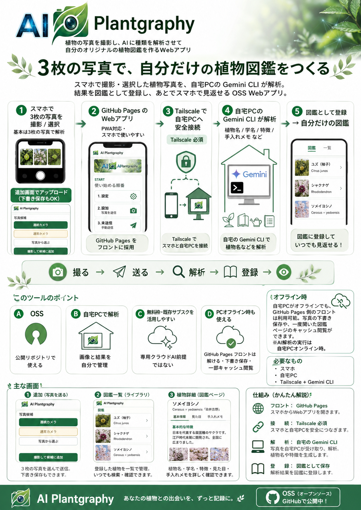
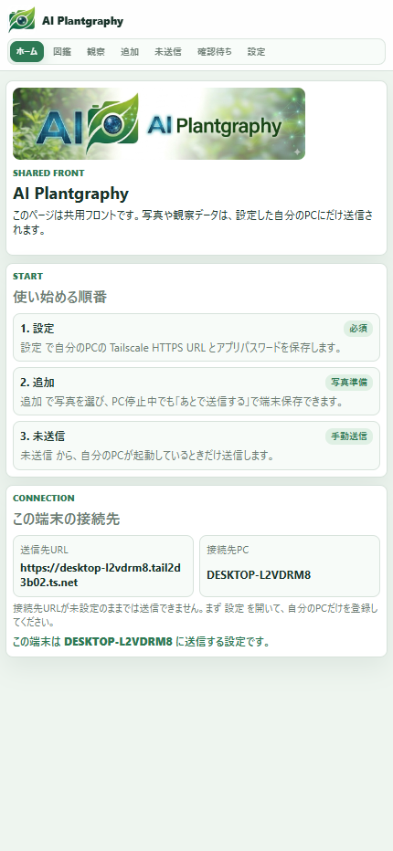
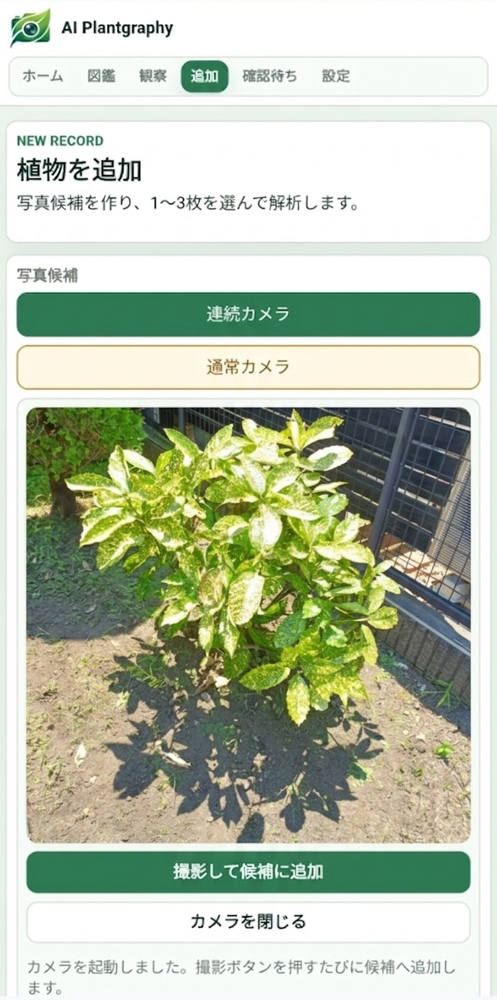
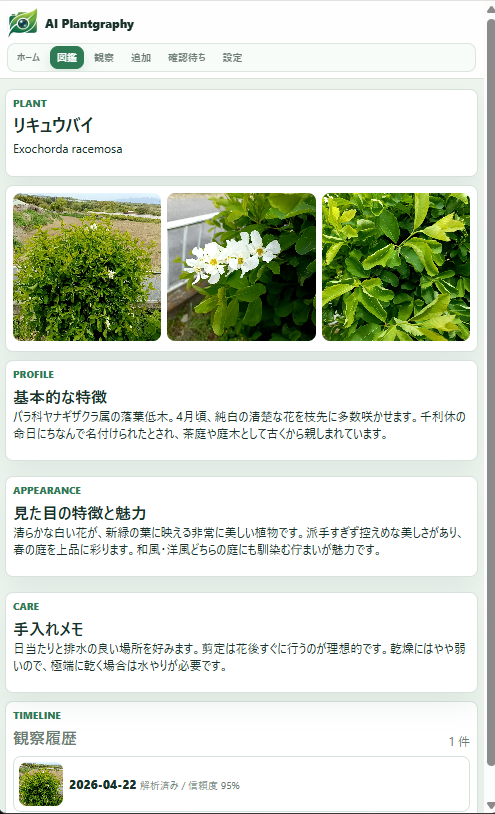
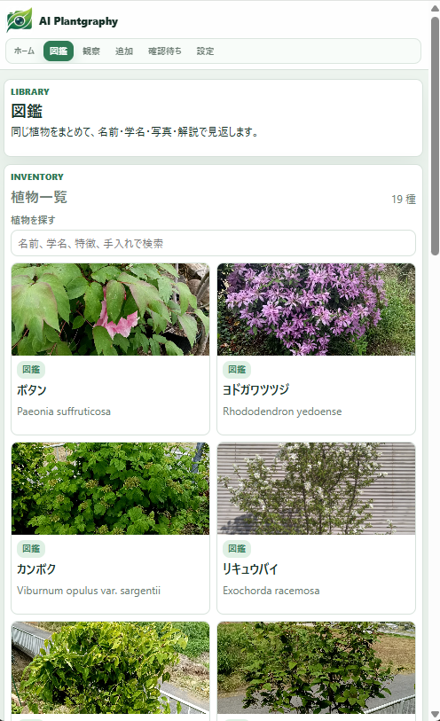
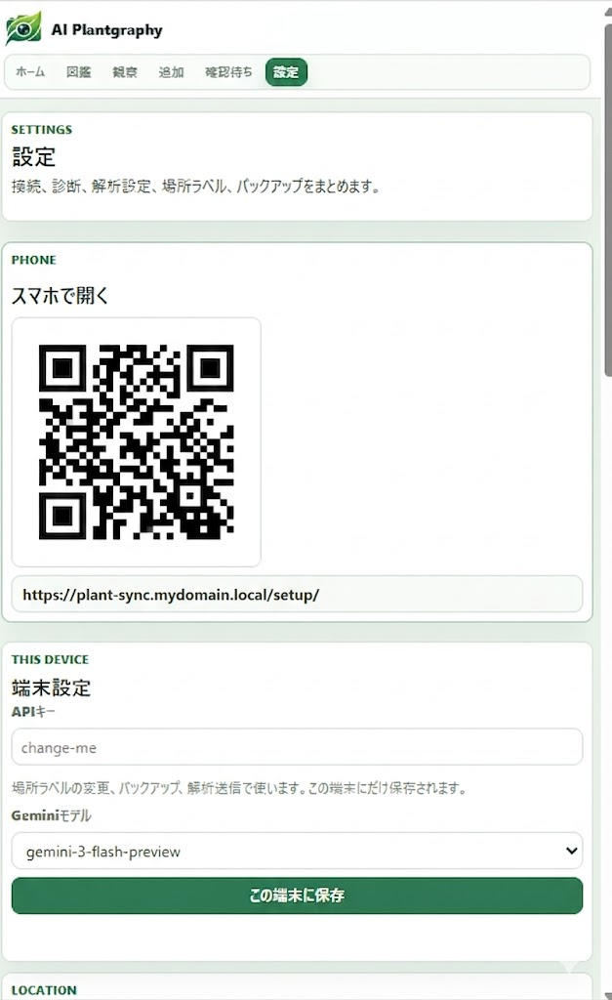

# AI Plantgraphy


AI Plantgraphy は、スマホで撮った植物写真をAIで解析し、自分だけの植物図鑑を作るWebアプリです。
庭木、草花、鉢植え、公園で見つけた植物などを写真と名前、特徴、手入れメモ付きで残せます。

公開中の共用フロント兼メインUI:

- [https://harunamitrader.github.io/AI-Plantgraphy/app/](https://harunamitrader.github.io/AI-Plantgraphy/app/)

この共用フロントには送信先URLの初期値を埋め込んでいません。各ユーザーが `設定` で自分のPCの Tailscale HTTPS URL とアプリパスワードを保存して使います。通常の利用では、この GitHub Pages 側を入口として使います。

## 1枚でわかる AI Plantgraphy



## 画面イメージ

スマホのブラウザまたはPWAから、撮影、解析待ち、図鑑の確認まで操作できます。画面は GitHub Pages 側に統一し、PC 側は API、画像配信、Gemini CLI、データ保存を担当します。

| ホーム | 植物を追加 |
| --- | --- |
|  |  |

| 植物詳細 | 図鑑 |
| --- | --- |
|  |  |

## できること

- スマホで植物の写真を1〜3枚選んで送信
- 自宅PC上の Gemini CLI で植物名を推定
- 解析結果、候補、見えている特徴、不確実な点を観察記録として保存
- 同じ種類の植物をまとめ、基本的な特徴、見た目の魅力、手入れメモを図鑑側に保存
- スマホから図鑑・観察記録・確認待ちを閲覧
- 一度オンラインで開いた図鑑一覧、観察一覧、確認待ち、植物詳細、観察詳細をオフラインでも見返す
- Tailscaleを使って外出先から自宅PCへ安全に接続
- 写真を軽量化して、スマホ表示を重くしすぎない
- zipバックアップ、場所ラベル、Geminiモデル選択に対応

## こんな人向け

- 庭やベランダの植物を写真付きで整理したい
- 植物名をAIに調べさせつつ、自分の記録として残したい
- なるべくクラウドに写真を預けず、自宅PC中心で使いたい
- スマホアプリのように使える個人用Webアプリを試したい

## 必要なもの

- Windows 11 PC
- AndroidまたはiPhoneのスマホ
- Gemini CLI
- Tailscaleアカウント
- GitとPython 3.11以上

初期確認は Windows 11 Pro、OPPO Reno11 A、ColorOS 15 / Android 15 を中心に行っています。

## まず使う

PowerShellでリポジトリを取得して、セットアップします。

```powershell
git clone https://github.com/harunamitrader/AI-Plantgraphy.git
cd AI-Plantgraphy
powershell -ExecutionPolicy Bypass -File .\scripts\install_windows.ps1
powershell -ExecutionPolicy Bypass -File .\scripts\create_desktop_shortcut.ps1
```

デスクトップに `AI Plantgraphy を起動` が作成されます。
それを開くと、PCサーバーとブラウザが立ち上がります。

詳しい手順:

- Windowsクイックスタート: [docs/QUICK_START_WINDOWS.md](docs/QUICK_START_WINDOWS.md)
- Tailscaleセットアップ: [docs/TAILSCALE_SETUP.md](docs/TAILSCALE_SETUP.md)

## Gemini CLIを有効にする

まずPCでGemini CLIが使えることを確認します。

```powershell
gemini --version
gemini --help
```

Gemini CLI側で必要なのは、次の2つです。

- Gemini CLIがGoogleアカウントまたはGemini APIキーで認証済みであること
- AI Plantgraphyの `data\images` に保存された画像を、PCの通常ユーザー権限で読み取れること

AI PlantgraphyはGemini CLIを `gemini -p` の非対話モードで呼び出し、植物解析のために画像パスとプロンプトを渡します。
Gemini CLIにリポジトリ全体の編集権限や、管理者権限を渡す必要はありません。
Gemini CLIがフォルダ信頼やサンドボックス設定を求める場合は、このリポジトリまたは `data` フォルダを読み取り対象として許可してください。

植物同定の出力契約は、リポジトリ同梱の Gemini スキル
`skills/plant-json-identifier/` に置いています。
アプリ本体は
`skills/plant-json-identifier/references/output-contract.md`
を読み、トップレベルのJSONキー契約を共有します。
Gemini CLI が自由文や入れ子JSONを返した場合は、サーバー側で
1回だけ厳格な再生成を試み、それでも崩れる場合に限って救済ロジックで整形します。

`.env` を開いて、以下を設定します。

```text
PLANT_DEX_GEMINI_ENABLED=true
PLANT_DEX_GEMINI_COMMAND=gemini
PLANT_DEX_GEMINI_MODEL=gemini-3-flash-preview
```

環境変数名は、旧名称との互換性のため `PLANT_DEX_` のまま残しています。
アプリ名は AI Plantgraphy です。

## スマホから使う

外出先で使う場合は、PCとスマホの両方でTailscaleにログインします。
PC側の設定ページでは、スマホで開くための QR コードは GitHub Pages 側を向きます。あわせて、`設定` の `接続先URL` に入れる **自分の PC の Tailscale HTTPS URL** も表示されます。

連続カメラを外出先で使うには、Tailscale ServeのHTTPS URLが必要です。



```powershell
powershell -ExecutionPolicy Bypass -File .\scripts\configure_tailscale_https.ps1
```

HTTPS化が難しい場合でも、通常カメラと写真選択は使えます。

## GitHub Pages 版を使う

AI Plantgraphy のユーザー向け画面は GitHub Pages 側を使います。PC停止中でも画面を開きたい場合も、この GitHub Pages 版を使います。

- 共用フロント: [https://harunamitrader.github.io/AI-Plantgraphy/app/](https://harunamitrader.github.io/AI-Plantgraphy/app/)
- セットアップ手順: [docs/GITHUB_PAGES_SETUP.md](docs/GITHUB_PAGES_SETUP.md)

この構成では:

- Web アプリの画面は GitHub Pages から開く
- 写真の一時保存はスマホ端末内で行う
- 実際の解析と正式保存は各ユーザーの自宅PCで行う
- PC 側の HTML 画面は保守用に残ることがあっても、通常の利用導線には使わない

安全のため、次のガードがあります。

- 接続先URLの初期値は空
- 送信前に接続先URLと接続先PC名を表示
- 下書き保存時の送信先URLと、送信時の送信先URLが一致しないと送信不可

## オフラインでできること

PC が起動していなくても、GitHub Pages 側の PWA から次の操作ができます。

- `追加` で写真候補を作る
- `あとで送信する` で未送信下書きを端末保存する
- `未送信` から下書きを確認する
- `設定` で接続先URLやアプリパスワードを確認する

さらに、**一度オンラインで開いたことがあるページ** は、保存済みキャッシュがあればオフラインでも見返せます。

- 図鑑一覧
- 観察一覧
- 確認待ち
- 植物詳細
- 観察詳細

オフライン時は画面上に `オフライン表示中 / 最新ではありません` を表示します。まだ保存していないページは `このページはまだオフライン保存されていません。` と表示されます。

補足:

- オフライン閲覧キャッシュは一覧JSONと一度開いた詳細JSONが中心です
- 写真はブラウザ標準キャッシュの影響を受けるため、端末や状況によってはオフライン中に一部表示されないことがあります
- オフライン中は `再解析` `削除` `修正して保存` などの更新操作はできません

## 写真を送る

Web画面では、次の3つの方法で写真候補を作れます。

- 連続カメラ
- 通常カメラ
- 写真から選ぶ

候補が3枚以上ある場合は、解析に使う写真を選べます。
何も選ばない場合は、あとから追加した3枚が優先されます。
1枚または2枚でも送信できます。

## データの保存場所

写真、SQLite DB、ログ、バックアップはPC内の `data` フォルダに保存されます。
GitHubへ公開するときは `data` と `.env` を含めないでください。

## バックアップ

Web画面の `設定` から、画像とデータベースをzipで保存できます。
バックアップを押すと、まず PC 側に zip を作成し、あわせてその端末にもダウンロードします。作成した zip は以下にも残ります。

```text
data\exports
```

## テスト

```powershell
.\.venv\Scripts\python.exe -m unittest discover -s .\server\tests -p "test_*.py"
.\.venv\Scripts\python.exe -m compileall .\server .\scripts
```

## ドキュメント

- Gemini CLI 同定スキル: [skills/plant-json-identifier/SKILL.md](skills/plant-json-identifier/SKILL.md)
- 出力契約: [skills/plant-json-identifier/references/output-contract.md](skills/plant-json-identifier/references/output-contract.md)
- 仕様書: [docs/SPECIFICATION.md](docs/SPECIFICATION.md)
- 実装計画書: [docs/IMPLEMENTATION_PLAN.md](docs/IMPLEMENTATION_PLAN.md)
- GitHub Pages セットアップ: [docs/GITHUB_PAGES_SETUP.md](docs/GITHUB_PAGES_SETUP.md)
- GitHub Pages 分離計画: [docs/GITHUB_PAGES_IMPLEMENTATION_PLAN.md](docs/GITHUB_PAGES_IMPLEMENTATION_PLAN.md)
- オフライン閲覧キャッシュ設計: [docs/OFFLINE_DATA_CACHE_DESIGN.md](docs/OFFLINE_DATA_CACHE_DESIGN.md)
- Windowsクイックスタート: [docs/QUICK_START_WINDOWS.md](docs/QUICK_START_WINDOWS.md)
- Tailscaleセットアップ: [docs/TAILSCALE_SETUP.md](docs/TAILSCALE_SETUP.md)
- 変更履歴: [CHANGELOG.md](CHANGELOG.md)
- 貢献ガイド: [CONTRIBUTING.md](CONTRIBUTING.md)
- セキュリティ: [SECURITY.md](SECURITY.md)

## 注意

AIの植物判定は間違うことがあります。
食用・薬用・毒性判断など、安全に関わる用途ではAI結果だけを信じないでください。

アプリパスワード、Gemini APIキー、Discord Webhook URL、位置情報、個人写真を公開IssueやPull Requestに貼らないでください。

## ライセンス

MIT Licenseです。詳細は [LICENSE](LICENSE) を確認してください。
