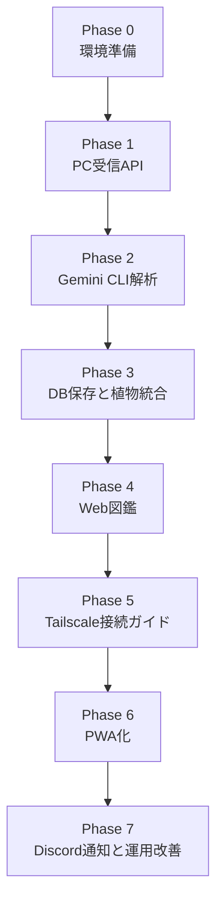

# Plant Dex 実装計画書

## 1. 方針

Plant Dex は、最初からネイティブアプリ・PCサーバー・AI解析・図鑑UIをすべて完成させるのではなく、PC側Web/PWA MVPを先に作り、外出先接続はTailscaleに一本化する。

理由は、植物解析と保存・統合ロジックが中核であり、Web/PWAならAndroid/iPhoneの両方から利用でき、非エンジニアにも配布しやすいためである。

## 2. 開発順序



## 3. Phase 0: 環境準備

### 目的

Windows 11 Pro 上でPCサーバーを開発・実行できる状態にする。

### 作業

- `plant-dex` をプロジェクトルートにする
- Python 3.12以上を確認する
- 仮想環境を作成する
- FastAPI関連パッケージを入れる
- Gemini CLIがWindows上で利用できることを確認する
- Tailscaleの導入方針を確認する

### 成果物

- `plant-dex\server`
- `plant-dex\server\requirements.txt`
- `plant-dex\.env.example`

### 確認項目

- `python --version` が実行できる
- `gemini --version` または相当コマンドが実行できる
- FastAPIのHello Worldが起動できる

## 4. Phase 1: PC受信API

### 目的

画像1〜3枚を受信して、観察記録フォルダに保存できるようにする。

### 作業

- FastAPIアプリを作成する
- `/api/health` を作る
- `/api/observations` を作る
- `multipart/form-data` で画像1〜3枚を受け取る
- APIキー認証を追加する
- 画像形式と枚数を検証する
- 観察記録IDを生成する
- 画像を `data\images` 配下に保存する

### 成果物

- `plant-dex\server\app\main.py`
- `plant-dex\server\app\config.py`
- `plant-dex\server\app\services\image_store.py`

### 確認項目

- PowerShellまたはcurlで画像1〜3枚をPOSTできる
- 保存フォルダに `1.jpg`, `2.jpg`, `3.jpg` が作成される
- 画像が1〜3枚でない場合にエラーになる
- APIキーなしで拒否される

## 5. Phase 2: Gemini CLI解析

### 目的

保存した画像1〜3枚をGemini CLIに渡し、植物解析結果をJSONとして受け取る。

### 作業

- Gemini CLI呼び出しサービスを作る
- PC側既定モデルとスマホ画面の選択値から `--model` を指定する
- 解析プロンプトを固定する
- 出力JSONのパース処理を作る
- タイムアウトを設定する
- 解析失敗時のエラー保存形式を決める
- `result.json` を観察記録フォルダに保存する

### 成果物

- `plant-dex\server\app\services\gemini_cli.py`
- `plant-dex\server\app\prompts\plant_identification.md`

### Geminiプロンプト方針

- 1〜3枚の写真を同一植物の観察として扱う
- 可能なら標準和名と学名を返す
- 不確実な場合は候補を複数返す
- 必ずJSONのみを返す
- 断定しすぎない
- 園芸・手入れメモも短く返す

### 確認項目

- 手元の画像1〜3枚で解析できる
- JSONとしてパースできる
- `common_name_ja`, `scientific_name`, `confidence`, `candidates` が取得できる
- Gemini CLI失敗時にサーバー全体が落ちない

## 6. Phase 3: DB保存と植物統合

### 目的

解析結果をSQLiteに保存し、同じ植物を自動でまとめる。

### 作業

- SQLite初期化処理を作る
- `plants`, `observations`, `candidate_names` テーブルを作る
- 観察記録を保存する
- Gemini解析結果を保存する
- 学名一致による自動統合を実装する
- 学名がない場合の標準和名一致を実装する
- 信頼度が低い場合は `needs_review` にする

### 成果物

- `plant-dex\server\app\db.py`
- `plant-dex\server\app\models.py`
- `plant-dex\server\app\services\plant_matcher.py`
- `plant-dex\data\plants.sqlite`

### 確認項目

- 新規植物なら `plants` に追加される
- 同じ学名なら既存 `plant_id` に紐づく
- 観察回数と最終撮影日が更新される
- 信頼度が低い場合は未確定扱いになる

## 7. Phase 4: Web図鑑

### 目的

スマホのブラウザから植物一覧・詳細・未確定データを見られるようにする。

### 作業

- `/` に植物一覧ページを作る
- `/plants/{id}` に植物詳細ページを作る
- `/observations/{id}` に観察記録詳細ページを作る
- `/review` に未確定一覧ページを作る
- 画像配信ルートを作る
- スマホ画面で見やすいレスポンシブUIにする

### 成果物

- `plant-dex\server\app\web\templates\index.html`
- `plant-dex\server\app\web\templates\plant_detail.html`
- `plant-dex\server\app\web\templates\observation_detail.html`
- `plant-dex\server\app\web\templates\review.html`
- `plant-dex\server\app\web\static\style.css`

### UI方針

- 最初の画面は植物一覧
- カードは植物ごとに1枚
- 代表画像を大きめに表示する
- 未確定データは目立つラベルを付ける
- スマホの片手操作で見やすい余白にする

### 確認項目

- PCブラウザで一覧が見える
- OPPO Reno11 A のブラウザで一覧が見える
- 画像が崩れず表示される
- 植物詳細から観察履歴を追える

## 8. Phase 5: Tailscale接続ガイド

### 目的

外出先のスマホからTailscale経由で自宅PCのAPIとWeb図鑑にアクセスできるようにする。

### 作業

- Tailscale IPを検出するサービスを作る
- ローカルWi-Fi URLとTailscale URLを生成する
- `/settings` に接続ガイド、診断、バックアップ、場所ラベル管理をまとめる
- `/api/connectivity` に診断情報を返す
- アップロード画面と図鑑トップのQRコードを表示する
- 起動ショートカットから `/settings` を開く
- APIキー初期値の場合に警告する

### 成果物

- `plant-dex\server\app\services\connectivity.py`
- `plant-dex\server\app\services\qr_code.py`
- `plant-dex\server\app\web\templates\connect.html`
- `plant-dex\docs\TAILSCALE_SETUP.md`

### 確認項目

- PC画面でTailscale用QRコードが表示される
- モバイル回線 + Tailscale ONのスマホからWeb図鑑が開ける
- モバイル回線 + Tailscale ONのスマホから画像1〜3枚をPOSTできる
- APIキーなしのPOSTが拒否される
- 自宅PC再起動後の復旧手順が分かる

## 9. Phase 6: PWA化

### 目的

スマホのホーム画面からアプリのようにPlant Dexを起動できるようにする。

### 作業

- Web App Manifestを追加する
- アイコンを追加する
- スマホ向け表示名を決める
- ホーム画面追加の案内を `/settings` に表示する
- 必要に応じてService Workerを追加する

### 成果物

- `plant-dex\server\app\web\static\manifest.webmanifest`
- `plant-dex\server\app\web\static\icons\`

### 確認項目

- OPPO Reno11 A のホーム画面に追加できる
- ホーム画面から起動できる
- Tailscale ONのモバイル回線でアップロードできる

## 10. Phase 7: Discord通知と運用改善

### 目的

解析完了をDiscordで把握できるようにし、日常運用しやすくする。

### 作業

- Discord Webhook URLを環境変数に追加する
- 解析成功時に植物名・信頼度・図鑑URLを通知する
- 解析失敗時にエラー通知する
- 再解析APIを作る
- 手動修正UIを追加する
- バックアップ手順を作る

### 成果物

- `plant-dex\server\app\services\discord_notify.py`
- 運用メモ

### 確認項目

- 解析成功時にDiscordへ通知される
- 解析失敗時にDiscordへ通知される
- DiscordトークンではなくWebhookだけを使っている

## 11. テスト計画

### 11.1 単体テスト

- 画像枚数検証
- 拡張子検証
- APIキー検証
- Gemini JSONパース
- 植物統合ロジック
- SQLite保存処理

### 11.2 結合テスト

- 画像1〜3枚POSTからDB保存まで
- Gemini CLI解析からWeb表示まで
- 同じ植物の2回目登録
- 信頼度低めの未確定登録

### 11.3 実機テスト

- OPPO Reno11 A / ColorOS 15 で撮影
- Android 15のカメラ権限確認
- Wi-Fi送信
- モバイル回線送信
- Web図鑑表示

## 12. リスクと対策

| リスク | 内容 | 対策 |
| --- | --- | --- |
| Gemini CLIの出力が揺れる | JSON以外の文章が混ざる | プロンプト固定、JSON抽出、失敗時保存 |
| 植物名の揺れ | アジサイ、紫陽花、Hydrangea など | 学名優先、手動修正を用意 |
| 自宅PC停止 | 外出先から送れない | 接続ページにPC起動・スリープ設定の注意を表示 |
| Tailscale未接続 | 外出先から送れない | `/settings` にTailscale状態と手順を表示 |
| 画像サイズ過大 | 通信や解析が遅い | スマホ側で圧縮、PC側で上限設定 |
| Web図鑑の外部閲覧 | 自宅情報が見える可能性 | Tailscale経由を標準にし、一般公開しない |

## 13. 初期MVPのタスク一覧

### Must

- PCサーバー起動
- 画像1〜3枚アップロード
- 画像保存
- Gemini CLI解析
- SQLite保存
- 植物一覧Web表示
- 植物詳細Web表示
- 同一植物の簡易統合

### Should

- 解析失敗時の再解析
- Discord通知
- Tailscale接続ガイド
- QRコード表示
- PWA化

### Could

- 位置情報
- ネイティブアプリ
- 手動統合UI
- 成長記録タイムライン
- 静的エクスポート

## 14. 推奨マイルストーン

### Milestone 1: PCローカルMVP

期間目安: 1日から2日

- FastAPIで画像1〜3枚を受信
- Gemini CLIで解析
- SQLiteに保存
- PCブラウザで図鑑表示

### Milestone 2: スマホ閲覧対応

期間目安: 半日から1日

- Web図鑑をスマホ向けに調整
- 同一LAN内でOPPO Reno11 Aから閲覧
- Tailscaleで外部閲覧

### Milestone 3: Tailscale/PWA対応

期間目安: 2日から4日

- `/settings` の接続ガイド
- Tailscale URL検出
- QRコード表示
- Web App Manifest
- ホーム画面追加案内

### Milestone 4: 運用改善

期間目安: 1日から2日

- Discord通知
- 再解析
- 手動修正
- バックアップ手順

## 15. 最初に実装する最小API

最初の実装では以下だけ作る。

```text
GET  /api/health
POST /api/observations
GET  /
GET  /plants/{id}
GET  /observations/{id}
```

これだけで、画像受信、解析、保存、図鑑表示の中核が検証できる。

## 16. 開発開始時の具体的手順

1. `plant-dex\server` を作る
2. Python仮想環境を作る
3. FastAPIのHello Worldを作る
4. `/api/observations` で画像1〜3枚を保存する
5. 手動で用意した植物画像1〜3枚をPOSTする
6. Gemini CLI呼び出しをつなぐ
7. SQLite保存をつなぐ
8. Web図鑑を作る
9. OPPO Reno11 A のブラウザで確認する
10. Tailscale接続ガイドとPWA化へ進む
