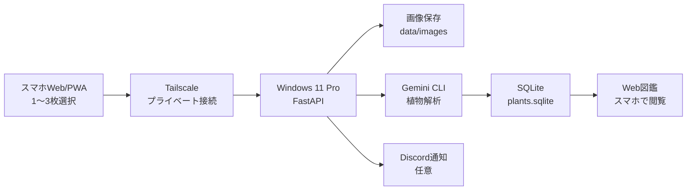

# AI Plantgraphy 仕様書

## 1. 概要

AI Plantgraphy は、スマホで庭木・草花の写真を基本3枚、必要に応じて1〜2枚でも撮影し、自宅PC上の Gemini CLI で植物を解析して、植物図鑑として後からスマホで見返せるようにする個人用アプリケーションである。

初期版では、スマホのWebブラウザまたはPWAから撮影・送信・図鑑閲覧を行う。外出先から自宅PCへ接続する標準手段は Tailscale とする。将来的に、同じAPIを使ってネイティブアプリを追加できる構成にする。

## 2. 対象環境

### 2.1 スマホ

- 端末: OPPO Reno11 A
- OS: ColorOS 15 / Android 15
- 主な役割:
  - WebブラウザまたはPWAで写真候補から1〜3枚を選択する
  - 任意メモを入力する
  - Tailscale経由で自宅PCの受信APIへアップロードする
  - 図鑑WebページをブラウザまたはPWAで開く

### 2.2 自宅PC

- OS: Windows 11 Pro
- 主な役割:
  - スマホから画像を受信する
  - 画像ファイルを保存する
  - Gemini CLI に画像1〜3枚を渡して解析する
  - 解析結果をSQLiteへ保存する
  - 植物図鑑Webページを提供する
  - 必要に応じてDiscordへ解析完了通知を送る

## 3. 目的

- 庭木や草花の写真から植物の種類を推定する
- 撮影記録を植物の種類ごとに自動整理する
- 同じ植物の成長や季節変化を後から見返せるようにする
- スマホだけで撮影から確認まで完結できる体験を作る
- 画像と解析結果を自宅PCに保管し、個人用データとして管理する
- 外出先でも自分のスマホから安全に自宅PCへ接続できるようにする

## 4. 非目的

初期版では以下を対象外とする。

- 植物判定の完全な正確性保証
- 一般公開向けのマルチユーザー機能
- iOS対応
- App Store / Google Play への公開
- 複数ユーザー権限管理
- 高度な植物分類AIの自前実装
- オフライン解析
- Cloudflare Tunnelを標準導線にすること

## 5. システム構成



## 6. 推奨技術スタック

### 6.1 スマホWeb/PWA

- HTML
- CSS
- JavaScript
- PWA manifest、将来対応
- ブラウザ標準のファイル選択・カメラ起動
- Tailscaleモバイルアプリ、外出先利用時

### 6.2 PCサーバー

- Python 3.12 以上
- FastAPI
- Uvicorn
- SQLite
- Jinja2、Web図鑑をサーバー描画する場合
- Gemini CLI
- Tailscale、外出先接続
- Discord Webhook、任意

## 7. 機能要件

### 7.1 スマホWeb/PWA

#### F-APP-001 写真撮影

- ユーザーは1回の観察記録につき写真候補から1〜3枚を選択できる。
- 写真は送信前にプレビューできる。
- 既存写真を選ぶ導線と、その場でカメラを起動する導線を分ける。

#### F-APP-002 メモ入力

- ユーザーは任意で短いメモを入力できる。
- 例:
  - 「庭の南側」
  - 「鉢植え」
  - 「花が咲き始め」

#### F-APP-003 画像送信

- アプリは写真1〜3枚を1セットとしてPCサーバーへ送信する。
- 外出先利用時の送信先はTailscale URLとする。
- 同じWi-Fi内での動作確認用にローカルIP URLも表示する。
- ブラウザからアップロードできるWeb画面を提供する。

#### F-APP-004 送信状態表示

- 送信中、送信成功、送信失敗を表示する。
- 失敗時は再送できる。

#### F-APP-005 図鑑表示

- 初期版ではスマホブラウザまたはPWAでWeb図鑑を開く。
- 将来的にはネイティブアプリ内画面で一覧・詳細を表示できるようにする。

#### F-APP-006 接続ガイド

- PC側の `/settings` にスマホ接続用QRコードを表示する。
- Tailscale用URLと同じWi-Fi用URLを表示する。
- Tailscale未設定時はセットアップ手順を表示する。

### 7.2 PCサーバー

#### F-SRV-001 画像受信

- `/api/observations` で画像1〜3枚を受け取る。
- `multipart/form-data` を使用する。
- 画像以外の任意データとしてメモ、撮影日時、位置情報を受け取れる。

#### F-SRV-002 入力検証

- 画像枚数が1〜3枚であることを検証する。
- 許可する画像形式は `jpg`, `jpeg`, `png`, `webp` とする。
- 1枚あたりの最大サイズを設定する。
- 初期値は1枚あたり25MB、合計75MBを目安とする。

#### F-SRV-003 画像保存

- 受信した画像を観察記録IDごとのフォルダに保存する。
- 保存時に長辺1600px以内のJPEGへ変換し、スマホ表示とGemini解析に使う画像を軽量化する。
- 保存先の例:

```text
plant-dex\data\images\20260411-114500-a1b2c3\
  1.jpg
  2.jpg
  3.jpg
  result.json
```

#### F-SRV-004 Gemini CLI解析

- 保存した1〜3枚の画像をGemini CLIに渡して植物解析を行う。
- PC側の既定モデルは `PLANT_DEX_GEMINI_MODEL` で指定する。
- 初期の既定モデルは `gemini-3-flash-preview` とする。
- アップロード時と再解析時に、スマホ画面から使用モデルを選択できる。
- 選択肢は `PLANT_DEX_GEMINI_MODEL_OPTIONS` で管理し、初期値は `auto-gemini-3`, `auto-gemini-2.5`, `gemini-3.1-pro-preview`, `gemini-3-flash-preview`, `gemini-2.5-pro`, `gemini-2.5-flash`, `gemini-2.5-flash-lite` とする。
- GeminiにはJSON形式で出力するよう指示する。
- 解析処理にはタイムアウトを設定する。
- 解析失敗時も観察記録は保存し、ステータスを `analysis_failed` とする。

#### F-SRV-005 解析結果保存

- Geminiの出力結果をSQLiteに保存する。
- 生のJSONも保存する。
- Web図鑑表示用に主要項目を正規化して保存する。

#### F-SRV-006 同一植物の自動統合

- Geminiが返した学名が既存の植物と一致する場合、同じ植物として紐づける。
- 学名がない場合は標準和名で照合する。
- 信頼度が低い場合は自動統合せず、未確定として保存する。
- 手動修正・手動統合を後からできるようにする。

#### F-SRV-007 Web図鑑

- スマホから閲覧できるWebページを提供する。
- 一覧ページ、詳細ページ、未確定一覧ページを持つ。
- 画像、植物名、学名、撮影回数、最終撮影日を表示する。

#### F-SRV-009 接続診断

- `/settings` で接続ガイド、診断、バックアップ、場所ラベル管理を提供する。
- `/api/connectivity` で接続候補URLと診断情報を返す。
- Tailscale IP、ローカルIP、Gemini CLI状態、APIキー状態を確認できる。
- スマホ用アップロードURLのQRコードを表示する。

#### F-SRV-010 バックアップ

- DBと画像フォルダをzipでエクスポートできる。
- エクスポートzipはPC側にも保存される。

#### F-SRV-011 観察記録削除

- 不要な観察記録を削除できる。
- 削除時は観察画像フォルダも削除する。
- 植物に他の観察がない場合は植物レコードも削除する。

#### F-SRV-008 Discord通知

- 任意機能として、解析完了時にDiscord Webhookへ通知する。
- Discordは画像・結果の主保存先ではなく、人間向け通知ログとして扱う。

## 8. 非機能要件

### 8.1 セキュリティ

- 自宅PCのAPIはTailscale経由でアクセスすることを標準とする。
- 初期版でも簡易APIキーを必須にする。
- APIキーはスマホブラウザのlocalStorageとPCサーバー環境変数に保持する。
- Discordのユーザートークンは使用しない。
- Discord連携はWebhookまたはBotトークンのみ使用する。
- APIキー初期値 `change-me` のままなら設定ページで警告する。
- Cloudflare Tunnelなどで外部公開する構成は標準サポート外とする。

### 8.2 プライバシー

- 画像は自宅PCに保存する。
- Gemini解析のため、画像はGoogle側サービスに送信される可能性がある。
- 位置情報は初期版では任意・後回しとする。
- Tailscale接続を標準とし、Web図鑑を一般公開しない。
- 位置情報や個人宅が特定される情報は、初期版では場所ラベル中心に扱う。

### 8.3 信頼性

- 送信失敗時はスマホ側で再送できる。
- 解析失敗時はPC側に未解析データとして残す。
- Gemini CLIのエラー内容をログに記録する。
- DBと画像フォルダは定期バックアップ可能な構造にする。
- 自宅PCがスリープ中またはAI Plantgraphy未起動の場合は利用できないことを接続ガイドに表示する。

### 8.4 性能

- 初期版の目標:
  - 画像送信: 通信環境に依存
  - Gemini解析: 30秒から3分程度を許容
  - Web図鑑表示: 1秒から3秒以内

### 8.5 保守性

- 画像保存、DB操作、Gemini呼び出し、Web表示を分離する。
- Gemini CLIからGemini APIへ差し替えやすい設計にする。
- スマホWeb/PWAとPCサーバーはAPI契約で疎結合にする。
- 将来のネイティブアプリ追加に備え、APIはWeb画面専用に閉じない。

## 9. データ設計

### 9.1 plants

植物の種類単位のテーブル。

| カラム | 型 | 説明 |
| --- | --- | --- |
| id | TEXT | 植物ID |
| display_name | TEXT | 表示名 |
| common_name_ja | TEXT | 標準和名 |
| scientific_name | TEXT | 学名 |
| aliases_json | TEXT | 別名JSON |
| description | TEXT | 説明 |
| representative_image_path | TEXT | 代表画像 |
| first_observed_at | TEXT | 初回撮影日時 |
| last_observed_at | TEXT | 最終撮影日時 |
| observation_count | INTEGER | 観察回数 |
| user_corrected | INTEGER | 手動修正済みフラグ |
| created_at | TEXT | 作成日時 |
| updated_at | TEXT | 更新日時 |

### 9.2 observations

1回の撮影・解析記録のテーブル。

| カラム | 型 | 説明 |
| --- | --- | --- |
| id | TEXT | 観察記録ID |
| plant_id | TEXT | 紐づく植物ID |
| status | TEXT | `queued`, `analyzing`, `analyzed`, `analysis_failed`, `needs_review` |
| captured_at | TEXT | 撮影日時 |
| received_at | TEXT | 受信日時 |
| note | TEXT | ユーザーメモ |
| location_label | TEXT | 場所ラベル |
| latitude | REAL | 緯度、任意 |
| longitude | REAL | 経度、任意 |
| image1_path | TEXT | 画像1 |
| image2_path | TEXT | 画像2 |
| image3_path | TEXT | 画像3 |
| confidence | REAL | Gemini推定信頼度 |
| raw_result_json | TEXT | Gemini生JSON |
| error_message | TEXT | エラー内容 |
| created_at | TEXT | 作成日時 |
| updated_at | TEXT | 更新日時 |

### 9.3 candidate_names

Geminiが返した候補名を保存するテーブル。

| カラム | 型 | 説明 |
| --- | --- | --- |
| id | TEXT | 候補ID |
| observation_id | TEXT | 観察記録ID |
| name | TEXT | 候補名 |
| scientific_name | TEXT | 候補学名 |
| confidence | REAL | 候補信頼度 |
| reason | TEXT | 推定理由 |

## 10. API仕様

### 10.1 POST `/api/observations`

写真1〜3枚を送信し、観察記録を作成する。

#### Request

Content-Type: `multipart/form-data`

| フィールド | 必須 | 説明 |
| --- | --- | --- |
| images | 必須 | 画像1〜3枚 |
| captured_at | 任意 | 撮影日時 |
| note | 任意 | メモ |
| location_label | 任意 | 場所ラベル |
| gemini_model | 任意 | この解析で使うGemini CLIモデル |
| latitude | 任意 | 緯度 |
| longitude | 任意 | 経度 |

Header:

```text
X-Plant-Dex-Api-Key: <api-key>
```

#### Response

```json
{
  "observation_id": "20260411-114500-a1b2c3",
  "status": "queued",
  "detail_url": "/observations/20260411-114500-a1b2c3"
}
```

### 10.2 GET `/api/observations/{id}`

観察記録の状態と解析結果を取得する。

### 10.3 GET `/api/plants`

植物一覧を取得する。

### 10.4 GET `/api/plants/{id}`

植物詳細を取得する。

### 10.5 POST `/api/observations/{id}/reanalyze`

解析失敗または未確定の観察記録を再解析する。
任意のフォーム項目 `gemini_model` で使用モデルを指定できる。

### 10.6 POST `/api/observations/{id}/correction`

観察記録の植物名、学名、メモ、場所ラベルを手動修正する。

### 10.7 DELETE `/api/observations/{id}`

観察記録と紐づく画像フォルダを削除する。

### 10.8 POST `/api/export`

植物DBと画像フォルダをzipでエクスポートする。

### 10.9 GET `/api/connectivity`

スマホ接続用のURL候補と診断情報を取得する。

## 11. Gemini出力仕様

Geminiには以下のようなJSONを返すように指示する。

```json
{
  "common_name_ja": "アジサイ",
  "scientific_name": "Hydrangea macrophylla",
  "confidence": 0.82,
  "candidates": [
    {
      "common_name_ja": "アジサイ",
      "scientific_name": "Hydrangea macrophylla",
      "confidence": 0.82,
      "reason": "葉の形状と花序の特徴が一致しています。"
    }
  ],
  "visible_features": [
    "対生の葉",
    "鋸歯のある葉",
    "球状の花序"
  ],
  "care_notes": "日当たりと水切れに注意してください。",
  "uncertainty_notes": "花が写っていない場合は近縁種との区別が難しいです。"
}
```

## 12. 画面仕様

### 12.1 スマホWeb/PWA

#### アップロード画面

- 写真から選ぶボタン
- カメラで撮るボタン
- 候補写真のプレビュー
- メモ入力欄
- 場所ラベル入力欄
- 送信ボタン
- 送信状態表示

#### 接続ガイド画面

- Tailscale用URL
- 同じWi-Fi用URL
- アップロード画面のQRコード
- 図鑑トップのQRコード
- Tailscaleセットアップ手順
- Gemini CLI状態
- APIキー状態
- Tailscale IP検出状態

### 12.2 Web図鑑

#### 植物一覧

- 代表画像
- 表示名
- 学名
- 観察回数
- 最終撮影日
- 未確定ラベル

#### 植物詳細

- 代表画像
- 植物名
- 学名
- Gemini説明
- 撮影履歴
- 各観察記録の3枚画像
- メモ
- 候補名
- 手動修正フォーム
- 再解析ボタン
- 削除ボタン

#### 未確定一覧

- 信頼度が低い観察記録
- 解析失敗した観察記録
- 手動修正ボタン
- 再解析ボタン

#### 観察記録一覧

- 全観察記録を時系列表示する
- 名前、学名、メモ、場所ラベルで検索できる

#### バックアップ画面

- APIキー入力欄
- zipエクスポートボタン
- 保存結果表示

## 13. 判定・統合ルール

### 13.1 自動統合

- `scientific_name` が既存植物と完全一致する場合は同じ植物とする。
- `scientific_name` が空で、`common_name_ja` が既存植物と一致する場合は同じ植物とする。
- `confidence` が0.65未満の場合は `needs_review` とする。

### 13.2 手動修正

- ユーザーは植物名を修正できる。
- ユーザーは学名を修正できる。
- 手動修正後は修正前のAI候補を参考情報として保持する。
- ユーザーは候補から修正欄へ名前・学名を入力できる。
- 複数植物レコードの手動統合は将来対応とする。

### 13.3 削除

- ユーザーは観察記録を削除できる。
- 観察記録削除時は画像フォルダも削除する。
- 削除後に観察が0件になった植物レコードは削除する。

## 14. ログ設計

PCサーバーは以下をログに残す。

- 画像受信
- 入力検証エラー
- Gemini CLI開始・終了
- Gemini CLIエラー
- DB保存結果
- Discord通知結果

ログ保存先:

```text
plant-dex\data\logs\server.log
```

## 15. フォルダ構成案

```text
plant-dex\
  docs\
    SPECIFICATION.md
    IMPLEMENTATION_PLAN.md
    TAILSCALE_IMPLEMENTATION_PLAN.md
    TAILSCALE_SETUP.md
  server\
    app\
      main.py
      config.py
      db.py
      models.py
      schemas.py
      services\
        export_store.py
        gemini_cli.py
        image_store.py
        observation_cleanup.py
        plant_matcher.py
        discord_notify.py
      web\
        templates\
        static\
    tests\
  data\
    exports\
    images\
    logs\
    plants.sqlite
  scripts\
```

## 16. 初期MVPの完了条件

- Windows 11 Pro上でFastAPIサーバーが起動する
- スマホまたはテストクライアントから画像1〜3枚を送信できる
- 画像が観察記録フォルダに保存される
- Gemini CLIで画像1〜3枚の解析が実行される
- 解析結果がSQLiteに保存される
- 同じ学名または標準和名の植物が自動でまとめられる
- Web図鑑の一覧・詳細ページで結果を確認できる
- OPPO Reno11 A のブラウザからWeb図鑑を閲覧できる
- Tailscale経由のURLを設定ページで確認できる
- スマホからQRコードでアップロード画面を開ける
- 観察記録を手動修正、再解析、削除できる
- DBと画像をzipでバックアップできる
